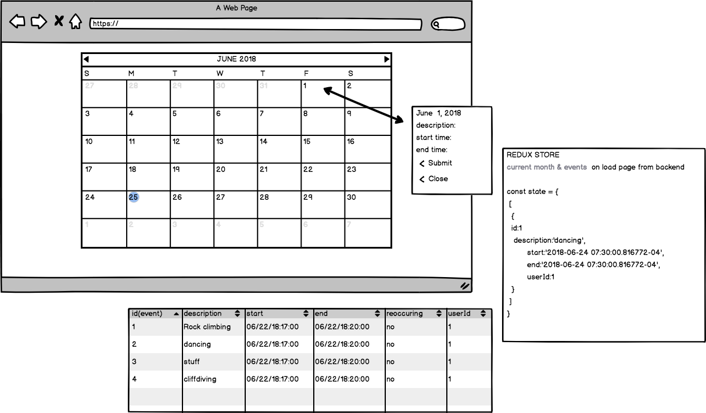

This project was bootstrapped with [Create React App](https://github.com/facebookincubator/create-react-app).

# Spotify Fellowship Application - Calendar App
- This project is build using React, Sequelize, PostgreSQL, and React-Redux
- Unit and Intergration test is done with Chai, Mocha, and Supertest for the API routes

Note: I could not change the src folders name to CalendarFrontend because of create-react-app.

## Deployed Link Below
[Spotify Calendar App](https://spotify-calendar-app.herokuapp.com/)

## Installation
Note: if you want to run test otherwise omit this command
```bash 
$ createdb spotify-calendar-test 
$ npm run test-server-watch
```

```bash

$ git clone
$ npm install 
$ createdb spotify-calendar

$ npm run seed
$ npm start

```

# Specs

- Able to click on a day box, and be able to create a new event on that day which gets sent to the  backend on clicking submit.
- Form has a start time, end time, description and submit. 
- Once submit is clicked the form should disappear.
- Event now appear in that day’s box.
- Events cannot span multiple days. Must start and end the same day.
- Show all events the user has on their calendar.
- The UI should have 4 rows of 7 boxes (simple case of a 28 day month).
- The application should communicate with an API backend using JSON.
### Optional Specs 
- Switch between months

## BACK END
- Able to update/delete/add/get events.

## Wireframe 





# Problems I faced and their solutions

## Deploying
- I tried to deploy using create-react-app but the provided index.html could not be read through heroku's environment because of the use of `%` example:
```html
 <link rel="manifest" href="%PUBLIC_URL%/manifest.json">
```
This flagged many errors when you first visit the page.

- One way i got around this is to create a build where webpack was used to create a bundle.js and not to rely on the react-scripts provided
- This created an easier deploy because I could pick to deploy bundle.js and bundle.js.map
Note: my deploy branch is available for review if required.

## Frontend

- When I started building this app I was trying to build dates functions from scratch but I soon found out that there is already a Date() function that has methods attached for find the Month, Days in a Month, Weekday of the Month, etc.
- Alot of my debugging was focused on the front end and passing down props to other components. 
- I wanted to at least have a ok view but I'm not very creative so my solution to that is to use a library for the interface to save time. I used material-ui for the buttons, tabs and modal/dialog.   


